# Threat Intelligence Platform

Threat Intelligence Platform est une plateforme de cybersécurité conçue dans le cadre d’un projet de fin d’année afin d’aider principalement les petites et moyennes entreprises à détecter plus rapidement certaines menaces, centraliser la visibilité sur leur parc logiciel et prioriser les vulnérabilités réellement importantes. Le projet réunit dans une même application deux besoins souvent traités séparément : l’analyse d’URL suspectes à l’aide d’un modèle de Machine Learning et la gestion intelligente des vulnérabilités à partir de l’inventaire réel des machines de l’organisation.

Le projet a été réalisé par **MELLAK Khadija, élève ingénieur en 4ème année ENSA Fès, Ingénierie logicielle, Data et Intelligence Artificielle**, dans le cadre d’un stage au **CMRPI — Centre Marocain de Recherches Polytechniques et d'Innovation**.

L’objectif n’est pas de remplacer les outils spécialisés d’un SOC ou les décisions d’un analyste sécurité, mais de fournir à une PME une vue exploitable et compréhensible : savoir quelles machines et quels logiciels sont présents, identifier les vulnérabilités qui leur sont associées, distinguer une exposition confirmée d’une exposition potentielle, interpréter des signaux tels que CVSS, EPSS ou CISA KEV, puis recevoir une alerte lorsque la situation devient réellement prioritaire.

## Présentation fonctionnelle

La plateforme repose sur deux piliers. Le premier est l’**analyse d’URL**. Un modèle de classification entraîné avec scikit-learn est chargé côté backend depuis un artefact Joblib et exposé par FastAPI. Une analyse peut être effectuée directement depuis la landing page publique sans création de compte, ou depuis l’espace authentifié. La réponse présente uniquement les informations réellement produites par le backend, notamment le verdict et la confiance lorsque celle-ci est disponible. L’analyse publique ne conserve pas d’historique et n’impose pas de limitation artificielle dans le cadre de cette version PFA.

Le second pilier est la **gestion des vulnérabilités orientée inventaire**. Un responsable sécurité peut inventorier les machines Windows de son organisation, importer les logiciels et versions détectés puis laisser la plateforme corréler ces composants avec les informations de vulnérabilités disponibles. Les données exploitées incluent notamment les identifiants CVE et CWE, les scores CVSS, les probabilités EPSS, le catalogue CISA Known Exploited Vulnerabilities ainsi que des signaux issus de GitHub Advisory. Ces sources ne sont pas affichées comme des nombres isolés : elles alimentent une vue de priorité destinée à répondre à une question opérationnelle simple, à savoir « que faut-il traiter en premier dans mon parc ? ».

Une exposition peut être marquée **confirmed** lorsque la correspondance entre le composant inventorié et les conditions de la vulnérabilité est suffisamment forte, ou **potential** lorsqu’une correspondance est plausible mais que certaines informations, comme une version précise, sont manquantes ou ambiguës. Une exposition potential n’est donc pas considérée comme un faux positif par défaut ; elle demande simplement une validation supplémentaire. La plateforme distingue aussi la **severity**, qui décrit principalement la gravité technique d’une vulnérabilité, de la **priority**, qui représente l’ordre de traitement recommandé dans le contexte du parc observé. Une vulnérabilité peut ainsi rester importante même lorsqu’un signal comme EPSS est absent.

La logique d’alertes V1 est volontairement limitée à des événements significatifs afin d’éviter le bruit. Une alerte est générée lorsqu’une nouvelle exposition **confirmed** apparaît directement avec une priorité **CRITICAL**, lorsqu’une exposition confirmed existante entre dans le catalogue **CISA KEV**, ou lorsqu’une exposition confirmed passe de **LOW, MEDIUM ou HIGH vers CRITICAL**. Les expositions potential ne déclenchent pas automatiquement ces alertes critiques. Une clé de déduplication empêche également le même événement de générer plusieurs alertes et plusieurs e-mails lors d’un rejeu. L’alerte métier est persistée avant la tentative d’envoi externe ; son statut peut donc être suivi même si la notification échoue. Les notifications sont destinées aux comptes actifs ayant le rôle `security_responsible` et l’envoi réel peut être assuré par l’API Gmail avec OAuth 2.0.

Deux rôles utilisateurs sont conservés pour rester cohérent avec le besoin d’une PME. Le rôle **staff** dispose d’un espace simple centré sur l’analyse d’URL et le centre d’aide. Il n’a aucun accès aux machines, logiciels, vulnérabilités ou alertes. Le rôle **security_responsible** dispose du cockpit complet : Dashboard, Machines, Inventaires, Logiciels, Vulnérabilités, Alertes, Utilisateurs, Analyse URL et Centre d’aide. L’inscription d’une nouvelle organisation crée son premier compte responsable sécurité ; les mots de passe sont hashés avec Argon2 et l’authentification repose sur des jetons JWT et des refresh tokens.

Le frontend comprend également une landing page publique et un centre d’aide entièrement intégré à l’application React. La documentation est volontairement orientée utilisateur plutôt que développeur : elle explique le fonctionnement quotidien de la plateforme, l’inventaire, les vulnérabilités, les alertes et des notions comme CVE, CWE, CVSS, EPSS, KEV, confirmed, potential, severity et priority. L’interface utilise une identité visuelle sobre basée sur le bleu marine, le bleu, le noir et le gris, avec le vert, l’orange et le rouge réservés aux états et niveaux de risque.

## Architecture et technologies

Le backend suit une séparation claire entre domaine, services applicatifs, ports et infrastructure. Les règles métier restent dans les couches `domain` et `application`, tandis que FastAPI, PostgreSQL, SQLAlchemy, les adaptateurs Gmail, le chargement du modèle ML et les repositories se trouvent dans `infrastructure`. Les migrations de base de données sont suivies avec Alembic. Le frontend est une application React/TypeScript indépendante qui consomme les API FastAPI.

```text
threat-intelligence-platform/
├── application/        services applicatifs, ports et règles d'orchestration
├── domain/             objets et concepts métier
├── infrastructure/     API FastAPI, persistence, adapters, notifications
├── database/           composants liés aux données et à l'ingestion
├── alembic/            migrations PostgreSQL
├── frontend/           application React + TypeScript
├── scripts/            scripts d'inventaire, développement et démonstration
├── tests/              tests unitaires, API, intégration et persistence
├── artifacts/          modèle ML et preuves de démonstration
└── notebooks/          travaux d'expérimentation et de Machine Learning
```

La stack principale comprend **Python**, **FastAPI**, **SQLAlchemy**, **PostgreSQL**, **Alembic**, **scikit-learn**, **NumPy**, **Joblib**, **Argon2**, **PyJWT** et **requests** côté backend. Le frontend utilise **React 19**, **TypeScript**, **React Router**, **Vite** et **Lucide React**. Le modèle URL actuellement chargé par l’API est l’artefact `url_multiclass_hgb_v3_hardened.joblib` accompagné de ses métadonnées. Le backend expose notamment les services d’authentification et d’inscription, l’analyse URL publique et authentifiée, l’inventaire, le dashboard, les machines, les logiciels, les vulnérabilités et leurs détails, ainsi que les alertes et leurs détails.

L’inventaire V1 est centré sur Windows. Un script PowerShell permet de collecter les logiciels installés sur les postes et serveurs, puis les données sont importées dans l’organisation correspondante. L’import et le traitement des vulnérabilités utilisent le même backend afin d’éviter une duplication de logique. La plateforme ne cherche pas à afficher la totalité d’une base CVE : elle présente les vulnérabilités corrélées au parc de l’organisation et les regroupe de façon utile dans les vues Machines, Logiciels, Vulnérabilités et Dashboard.

La sécurité du projet repose sur plusieurs niveaux : isolation par organisation, contrôle d’accès selon le rôle, API keys dédiées aux imports machines, hash Argon2 pour les mots de passe, JWT pour les accès utilisateurs, secrets uniquement fournis par variables d’environnement et absence volontaire de credentials réels dans le dépôt. Le fichier `.env.example` documente les variables nécessaires sans contenir de secrets exploitables.

## Démonstration et validation finale

La validation finale a été effectuée avec des scénarios reproductibles placés dans `scripts/demo/`. L’objectif était de tester les véritables services de la plateforme sans dépendre d’un changement externe imprévisible pendant l’enregistrement vidéo. Une vulnérabilité réelle et connue, **CVE-2021-44228 (Log4Shell)**, a été utilisée comme support de démonstration. Les transitions de priorité et de KEV ont été rejouées de manière contrôlée, mais l’évaluation des règles, la persistence PostgreSQL, la déduplication et l’envoi Gmail utilisent les composants réels de l’application.

Le scénario principal a validé une exposition confirmed passant de **HIGH vers CRITICAL**. La plateforme a créé une alerte `priority_transition_to_critical`, l’a persistée, puis a envoyé avec succès une notification Gmail au responsable sécurité. Un rejeu du même événement a produit zéro nouvelle alerte et zéro nouvelle notification, confirmant le mécanisme de déduplication. Un scénario potential passé à CRITICAL a produit zéro alerte, conformément à la policy V1. L’entrée d’une exposition confirmed dans CISA KEV a généré l’alerte `confirmed_exposure_entered_kev` et un e-mail réel. Enfin, la création d’une nouvelle exposition confirmed directement CRITICAL a déclenché `new_confirmed_critical_exposure` et une nouvelle notification réussie.

Les captures suivantes proviennent de cette campagne de validation et sont conservées dans le dépôt afin de pouvoir être réutilisées dans le rapport final et la vidéo de présentation.

**Dashboard avant la transition de priorité**

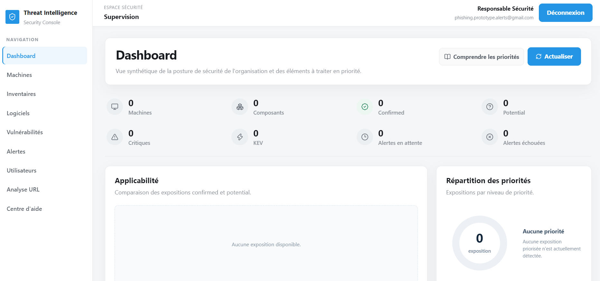

**Dashboard après les scénarios de démonstration**

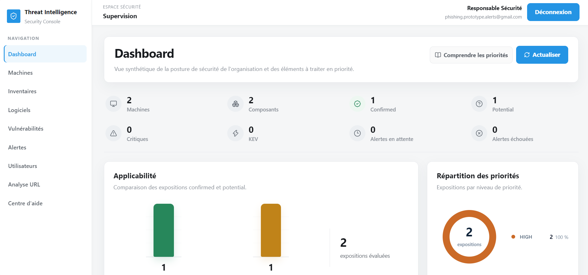

**Machines de démonstration et distinction confirmed / potential**

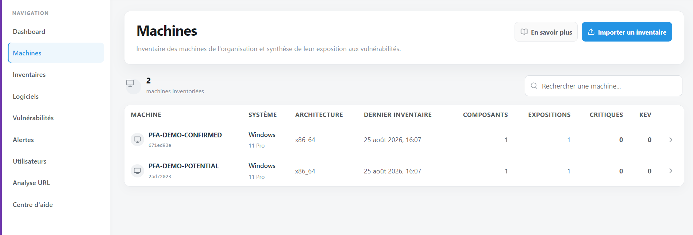

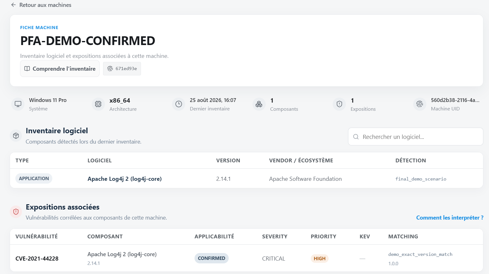

**Vue des vulnérabilités après traitement**

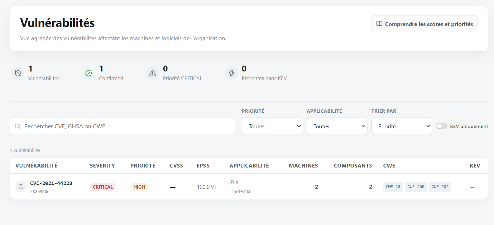

**Vue Logiciels corrélée au parc**

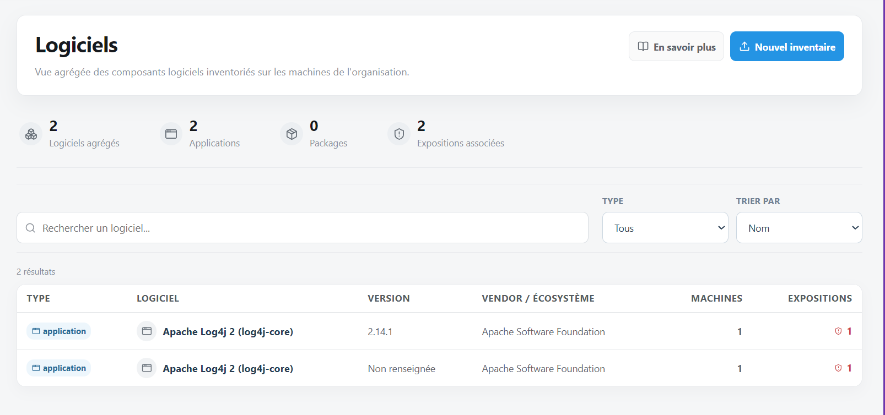

**Alerte créée par la plateforme et notification Gmail réelle**

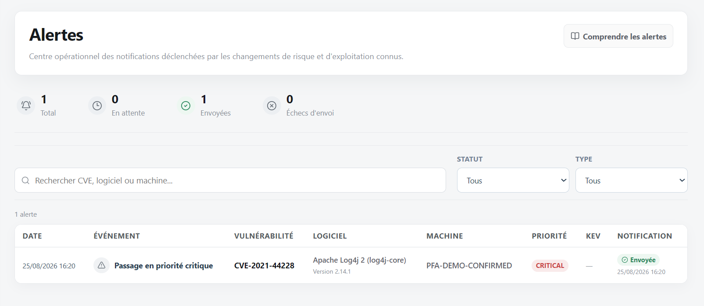

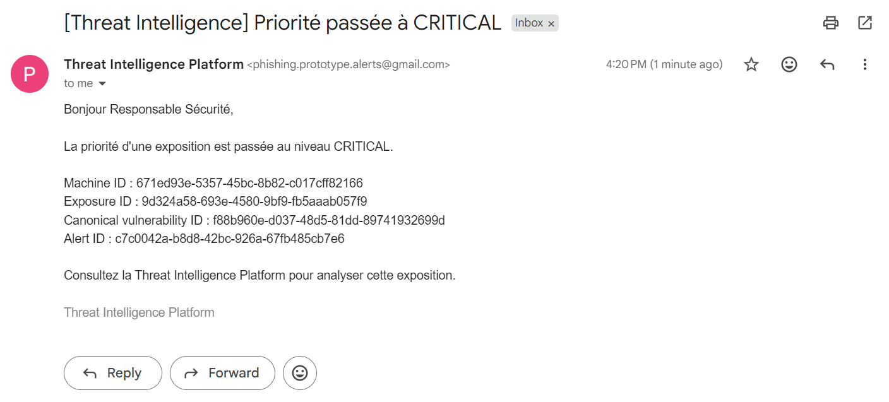

**Entrée confirmée dans CISA KEV**

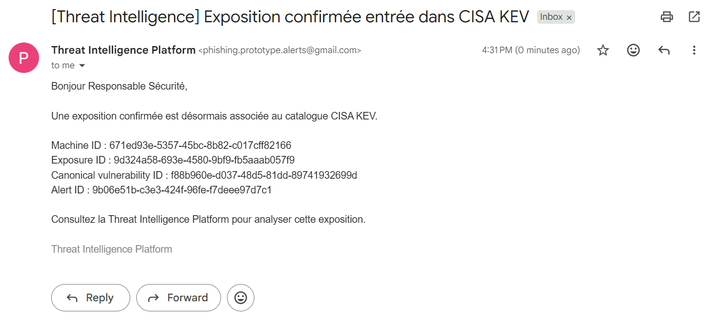

**Nouvelle exposition confirmed critique**

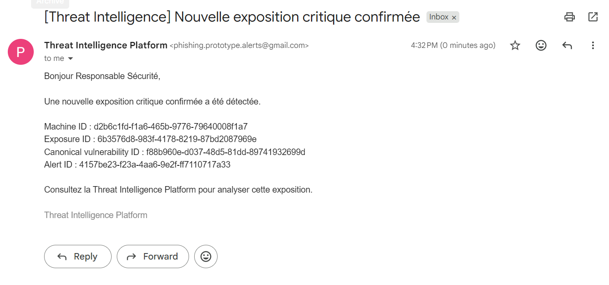

**Scénario potential critique sans génération d’alerte**

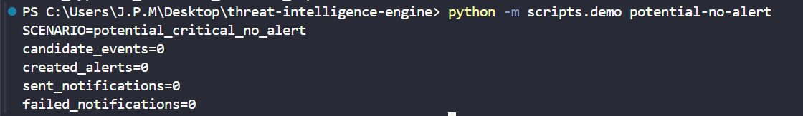

Ces scénarios complètent les tests unitaires et d’intégration présents dans `tests/`, qui couvrent notamment l’API, l’authentification, les accès par rôle, les repositories, l’évaluation des alertes, la persistence des statuts de livraison et les adaptateurs de notification.

## Installation et exécution locale

Le projet nécessite une installation Python, PostgreSQL et Node.js. Une configuration locale doit être créée à partir de `.env.example`. Les mots de passe de base de données, secrets JWT, API keys machines et éventuels identifiants OAuth Gmail doivent rester uniquement dans `.env` et ne doivent jamais être commités.

Pour préparer le backend sous Windows :

```powershell
python -m venv .venv
.\.venv\Scripts\Activate.ps1
pip install -r requirements.txt
alembic upgrade head
uvicorn infrastructure.api.main:app --reload
```

L’API FastAPI est alors disponible localement, avec un endpoint `/health` permettant de vérifier que le service répond. La documentation interactive générée par FastAPI peut être utilisée pendant le développement pour inspecter les endpoints exposés.

Pour lancer le frontend :

```powershell
cd frontend
npm install
npm run dev
```

Vite démarre par défaut l’application sur le port de développement configuré pour le frontend. Les origines `http://localhost:5173` et `http://127.0.0.1:5173` sont autorisées côté API en environnement local.

Pour les tests classiques, le dépôt utilise `pytest` côté Python et fournit également les commandes `npm run lint` et `npm run build` côté frontend. Les scénarios finaux de démonstration peuvent être inspectés dans `scripts/demo/README.md` et exécutés via `python -m scripts.demo <commande>` après configuration des variables de démonstration. Ils sont destinés à la validation et à la production de preuves pour le rapport, et non à remplacer les flux métier normaux de l’application.

## Contexte académique

Ce dépôt représente l’aboutissement d’un projet mêlant ingénierie logicielle, cybersécurité, traitement de données et intelligence artificielle. Le travail a couvert la préparation et l’exploitation d’un modèle de classification d’URL, la conception d’une architecture backend modulaire, la normalisation et la corrélation de données de vulnérabilités, la gestion d’un inventaire multi-machines, la priorisation des expositions, les alertes avec notification Gmail, l’authentification et l’isolation des organisations, ainsi que la réalisation d’une interface React complète avec landing page publique, espaces par rôle et centre d’aide intégré.

**Réalisé par : MELLAK Khadija**  
Élève ingénieur en 4ème année, ENSA Fès  
Filière : Ingénierie logicielle, Data et Intelligence Artificielle  
Centre accueillant de stage : **CMRPI — Centre Marocain de Recherches Polytechniques et d'Innovation**
